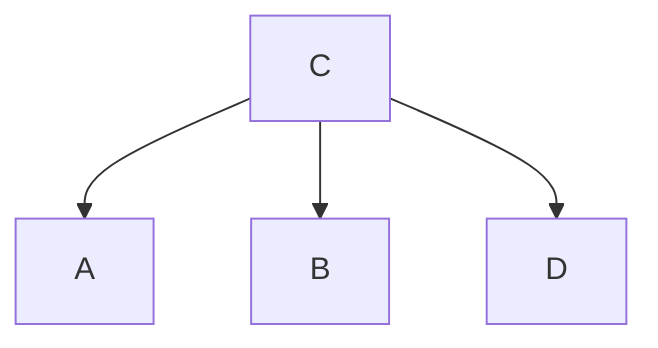

**什么是B数**
- **B树：** 是一种多路平衡查找树，多应用于数据库和文件系统中，在B树中能够保证数据有序。B数只有一层叶子节点
- **特征：** 对于m阶的B数来说它最多情况下有m个分支，m-1个元素，最少情况下根节点有2个分支和1个元素，其他节点中有m/2个分支，m/2个元素（其中m/2如果是小数则向上取整，例如5/2=2.5≈3）

**b树的根节点是如何分裂出新节点的，1层的b树根节点分裂出新节点是不是叶子节点**

- ==当前根节点有三个数据分别是A、B、C，现在将D数据插入==

- ==将D数据插入但导致了根节点上溢出==

- ==选择中间数据B或C作为新的根节点==


**2层的b树在插入数据时是插入根节点还是叶子节点**
- **陈述：** 插入的数据先查找到要插入的位置（叶子节点），如果发生上溢出则将中间的数据上移至父节点，两边的数据分割为两个节点
 
**如果叶子节点的数据满了是向下拆分还是向上拆分，或是其他什么方式**
- **叶子节点溢出：** 当叶子节点溢出时，它会将中间的数据上移至父节点，两边的数据进行分裂

**b树中在叶子节点的数据可能会移动到根节点中吗，为什么**
- **陈述：** 在b树中叶子节点数据可能会移动到根节点，因为在b树中插入的数据可能会导致叶子数据进行上溢出

**b树中的节点除了索引信息外，会携带数据信息吗，为什么这样设计，有什么优缺点**
- **陈述：** 在b树中每个键都对应着数据信息，这样可以在检索到要找的键后就取值
- **优点：** 当找到目标键后就可以直接访问到改键所指的数据
- **缺点：** 每个键都携带数据信息导致占用了节点更多的空间，使单个节点无法容纳更多的键

**什么是b+树，与b树有什么区别**
- **b+树：**和b树一样，b+树也是一种多路平衡查找树
- **区别：** 
  - b+树的非叶子节点不再存储数据记录使非叶子节点存储的键值量更大，提高了非叶子节点的扇出能力
  - 由于b+树将所有数据记录存放在叶子节点，而叶子节点有以链表的形式连接，在范围查找中在定位到初始值后直接顺序查找，不再需要b树那样进行中序查找，提升了查找效率

**b+树的“扇出”是什么意思，扇出数量的大有什么好处**
- **扇出：** 是指父节点拥有子节点的数量
- **优点：** 更大的扇出就意味着在数据量相同的情况下它的树高更低，树更低也就意味着在查找数据是会产生更少的io，也就提高了查询的效率

**b+数中的索引信息是不是会有冗余，这个冗余有什么作用**
- **陈述：** 在b+树中索引会出现冗余，因为在b+树中只有叶子节点才会存储数据记录，所以会出现非叶子节点与叶子节点键值相同的情况
- **作用：** 因为在b+树中将数据记录全部存储在了叶子节点中，从而使非叶子节点有了更大的容量能够存储更多的键值，也就是扇出变得更大了。

**b+树中叶子节点之间的链表有什么作用**
- **链表作用：** 链表在范围查找中只需要定位到起键就可以进行顺序查找，因为是顺序查找所以提高了查询效率

**mysql默认存储引擎使用的是b数还是b+树**
- b+树

**创建一个表格，用于记录学生成绩，要求记录姓名、语文、数学、英语、小组，插入30条随机数据，每10人为一组，共三组，每科成绩最高100分，最低0分**
**按照语文分数进行排名，要求输出排名、分数、姓名、小组名**
```
select @rank := @rank + 1 as '排名', chinese as '语文成绩',name as '姓名',group_name as '小组' from score,(select @rank :=0) as r order by chinese desc;
```

**计算查询表中的总分，并进行排名，要求输出排名、小组、姓名、总分**
```
select @rank := @rank + 1 as '排名', chinese+math+english as '总分',name as '姓名',group_name as '小组' from score,(select @rank :=0) as r order by (chinese+math+english) desc;
```

**计算查询各个小组的总分平均分，并对小组进行排名，输出排名及小组平均分**
```
select @rank := @rank + 1 as '排名',avg_total as '平均分', group_name as '组名' from (select avg (chinese+math+english) as avg_total, group_name from score group by group_name order by avg_total desc) as son join (select @rank :=0) as r;
```

**查询每个小组的数学最高分的学生姓名和分数**
```
select s.name as '姓名', s.math as '数学', s.group_name as '小组' from score s left join score s2 on s.group_name=s2.group_name and s.math < s2.math where s2.name is null order by s.group_name;
```

**查询所有总分大于所在小组平均分的学生**
```
select * from (select group_name,avg(math+english+chinese) as avgscore from score group by group_name)as s join (select name,group_name, (math+chinese+english) as totalscore from score ) as g on s.group_name=g.group_name where s.avgscore<g.totalscore;
```

**查询每个小组中各科成绩最高的学生姓名和成绩**
```
select s.name as '姓名', s.math as '分数', s.group_name as '小组','数学' as 'km' from score s left join score s2 on s.group_name=s2.group_name and s.math < s2.math where s2.name is null
union all 
select s.name ,s.chinese, s.group_name ,'语文' as 'km' from score s left join score s2 on s.group_name=s2.group_name and s.chinese < s2.chinese where s2.name is null
union all 
select s.name ,s.english ,s.group_name,'英语' as 'km' from score s left join score s2 on s.group_name=s2.group_name and s.english < s2.english where s2.name is null
```

**按小组对学生进行分组管理，并计算每个小组中每科成绩高于80分的学生数量**
```
select group_name as '组名', sum(case when Chinese >80 then 1 else 0 end) as '语文',sum(case when math >80 then 1 else 0 end) as '数学',sum(case when english >80 then 1 else 0 end) as '英语' from score group by group_name;
```

**查询每个小组中总分与小组平均分差距最大的学生姓名、总分和差距**
```
```
