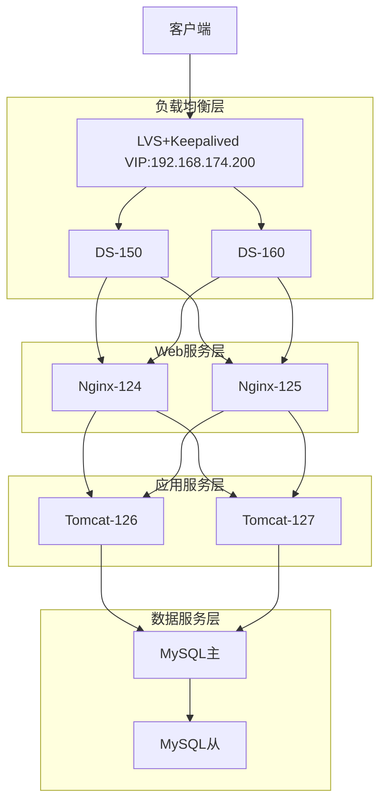

您的思路非常棒！将 LVS+Keepalived 与 Nginx、Tomcat 和 MySQL 集成，可以构建一个完整的高可用、高性能应用架构。下面我为您设计一个分层架构方案，帮助您系统地理解和实践每个组件的角色与协作：

### 完整集群架构设计



### 分层实施规划

#### 1. Web服务层 (Nginx)
**角色**：静态资源服务 + 反向代理 + 负载均衡  
**节点**：192.168.174.124, 192.168.174.125  
**配置要点**：
```nginx
# /etc/nginx/nginx.conf
upstream tomcat_cluster {
    # Tomcat应用层节点
    server 192.168.174.126:8080 weight=5;
    server 192.168.174.127:8080 weight=5;
    keepalive 32;
}

server {
    listen 80;
    
    # 静态资源
    location /static/ {
        root /var/www/html;
        expires 30d;
    }
    
    # 动态请求
    location / {
        proxy_pass http://tomcat_cluster;
        proxy_http_version 1.1;
        proxy_set_header Connection "";
        proxy_set_header X-Real-IP $remote_addr;
        proxy_set_header X-Forwarded-For $proxy_add_x_forwarded_for;
    }
    
    # 健康检查端点
    location /nginx_status {
        stub_status;
        allow 192.168.174.0/24;
        deny all;
    }
}
```

#### 2. 应用服务层 (Tomcat)
**角色**：业务逻辑处理 + 会话管理  
**节点**：192.168.174.126, 192.168.174.127  
**配置要点**：
```bash
# 安装JDK+Tomcat
yum install -y java-11-openjdk tomcat

# 配置连接池 /etc/tomcat/context.xml
<Resource name="jdbc/myDB" 
          auth="Container"
          type="javax.sql.DataSource"
          maxTotal="100"
          maxIdle="30"
          maxWaitMillis="10000"
          username="app_user"
          password="securepass"
          driverClassName="com.mysql.cj.jdbc.Driver"
          url="jdbc:mysql://192.168.174.128:3306/app_db?useSSL=false&amp;characterEncoding=UTF-8"/>
```

#### 3. 数据服务层 (MySQL)
**角色**：数据持久化 + 高可用  
**节点**：
- 主库：192.168.174.128
- 从库：192.168.174.129
- VIP：192.168.174.202 (由Keepalived管理)

**配置要点**：
```bash
# 主库配置 /etc/my.cnf
[mysqld]
server-id=1
log-bin=mysql-bin
binlog-format=ROW

# 从库配置
[mysqld]
server-id=2
relay-log=mysql-relay-bin
read-only=1

# 配置主从复制
CHANGE MASTER TO
MASTER_HOST='192.168.174.128',
MASTER_USER='repl',
MASTER_PASSWORD='replpass',
MASTER_LOG_FILE='mysql-bin.000001',
MASTER_LOG_POS=154;
```

#### 4. 负载均衡层增强 (LVS+Keepalived)
**优化配置**：
```keepalived
vrrp_instance VI_1 {
    state MASTER
    interface ens160
    virtual_router_id 51
    priority 100
    virtual_ipaddress {
        192.168.174.200/32
    }
}

# 添加对Nginx的健康检查
virtual_server 192.168.174.200 80 {
    delay_loop 5
    lb_algo wlc
    lb_kind DR
    protocol TCP
    
    real_server 192.168.174.124 80 {
        weight 10
        HTTP_GET {
            url {
                path /health
                status_code 200
            }
            connect_timeout 3
            nb_get_retry 2
            delay_before_retry 1
        }
    }
    
    real_server 192.168.174.125 80 {
        weight 10
        HTTP_GET {
            url {
                path /health
                status_code 200
            }
            connect_timeout 3
            nb_get_retry 2
            delay_before_retry 1
        }
    }
}
```

### 关键集成点详解

#### 1. 会话保持方案
**问题**：Tomcat集群需要共享会话  
**解决方案**：
1. **Redis会话存储**：
   ```xml
   <!-- 在Tomcat的context.xml中添加 -->
   <Valve className="com.orangefunction.tomcat.redissessions.RedisSessionHandlerValve"/>
   <Manager className="com.orangefunction.tomcat.redissessions.RedisSessionManager"
            host="192.168.174.130"
            port="6379"
            database="0"
            maxInactiveInterval="1800"/>
   ```
   
2. **Nginx IP Hash**：
   ```nginx
   upstream tomcat_cluster {
       ip_hash;
       server 192.168.174.126:8080;
       server 192.168.174.127:8080;
   }
   ```

#### 2. 数据库高可用
**方案**：Keepalived + MySQL主从
```keepalived
# 在MySQL节点上的Keepalived配置
vrrp_instance VI_DB {
    state MASTER
    interface ens160
    virtual_router_id 52
    priority 150
    virtual_ipaddress {
        192.168.174.202/32
    }
    
    # 自定义健康检查
    track_script {
        chk_mysql
    }
}

vrrp_script chk_mysql {
    script "/usr/bin/mysql -uroot -pdbpass -e 'SELECT 1'"
    interval 2
    weight 2
    fall 2
    rise 1
}
```

#### 3. 全链路监控
**部署Prometheus+Granafa**：
```yaml
# prometheus.yml 配置示例
scrape_configs:
  - job_name: 'lvs'
    static_configs:
      - targets: ['192.168.174.150:9100', '192.168.174.160:9100']
        
  - job_name: 'nginx'
    metrics_path: /nginx_status
    static_configs:
      - targets: ['192.168.174.124:80', '192.168.174.125:80']
        
  - job_name: 'tomcat'
    static_configs:
      - targets: ['192.168.174.126:8080', '192.168.174.127:8080']
        
  - job_name: 'mysql'
    static_configs:
      - targets: ['192.168.174.128:9104', '192.168.174.129:9104']
```

### 分阶段实施计划

#### 阶段1：基础环境搭建
1. 部署Nginx节点（124,125）
2. 部署Tomcat节点（126,127）
3. 部署MySQL主从（128,129）
4. 配置LVS+Keepalived（150,160）

#### 阶段2：服务集成
1. Nginx配置Tomcat反向代理
2. Tomcat配置MySQL连接
3. 配置MySQL主从复制
4. 添加Redis会话共享（可选）

#### 阶段3：高可用强化
1. 配置MySQL VIP（202）和Keepalived
2. 实现数据库故障自动切换
3. 配置应用层健康检查
4. 设置自动故障转移脚本

#### 阶段4：监控优化
1. 部署Prometheus+Granafa
2. 配置各层指标采集
3. 设置警报规则
4. 压力测试与调优

### 关键验证点

1. **LVS层**：
   ```bash
   ipvsadm -Ln --stats
   # 检查连接分发是否均衡
   ```
   
2. **Nginx层**：
   ```bash
   curl http://192.168.174.124/nginx_status
   # 检查活跃连接数
   ```

3. **Tomcat层**：
   ```bash
   curl http://192.168.174.126:8080/app/status
   # 验证应用状态
   ```

4. **MySQL层**：
   ```sql
   SHOW SLAVE STATUS\G
   -- 确保Seconds_Behind_Master为0
   ```

### 典型问题解决方案

**数据库连接故障转移**：
```java
// 在应用中使用支持故障转移的JDBC URL
jdbc:mysql:replication://192.168.174.202,192.168.174.128,192.168.174.129/app_db
?autoReconnect=true
&failOverReadOnly=false
&roundRobinLoadBalance=true
```

**Nginx+Tomcat 健康检查集成**：
```nginx
location /health {
    proxy_pass http://tomcat_cluster/health;
    proxy_next_upstream error timeout http_500;
}
```

**脑裂防护**：
```keepalived
# 在Keepalived配置中添加
vrrp_instance VI_1 {
    unicast_peer {
        192.168.174.150 # 主节点
        192.168.174.160 # 备节点
    }
    authentication {
        auth_type AH
        auth_pass secretkey
    }
}
```

### 学习收益

通过这个完整架构，您将掌握：
1. **分层架构设计**：理解各层职责和交互
2. **高可用实现**：从负载均衡到数据库的全栈HA
3. **性能优化**：静态资源、连接池、缓存等优化点
4. **故障排查**：全链路监控和日志分析
5. **自动化运维**：脚本化部署和配置管理

建议您按阶段实施，每完成一个阶段进行验证和测试。遇到具体问题时，可以针对该环节深入探讨。这个架构可以作为中小型互联网应用的参考架构，涵盖了绝大多数生产环境需要的组件和配置。