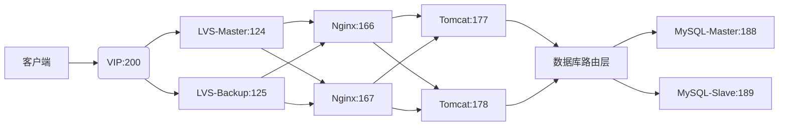

**0.准备工作**
==所有服务器关闭防火墙、selinux==
- **地址划分**
    - lvs：124、125 ipvsadm、keepalived
    - nginx：166、167 nginx
    - tomcat：177、178 tomcat
```
systemctl stop firewalld
setenforce 0
```
**1.LVS+Keepalived**
- **安装软件**
`yum install keepalived ipvsadm -y`
- **配置主备节点**
`vim /etc/keepalived/keepalived.conf`
- **启动服务**
`systemctl start keepalived`
- **验证vip和状态**
```
-- 查看vip绑定情况
ip addr show ens160 | grep 192.168.174.200 
-- 查看LVS规则
ipvsadm -Ln 
```

**2.nginx**
- **安装启动nginx**
```
-- 安装epel
yum install epel-release -y
yum install nginx -y
systemctl start nginx
```
- **配置realserver文件**
编写好文件赋予权限执行文件/etc/init.d/
- **查看realserver脚本效果**
```
ip addr show lo:0
-- 路由指向lo
route -n | grep 192.168.174.200
```
- **验证lvs和nginx接入状态**
```
-- 输出两条真实ip
ipvsadm -Ln
-- 测试174.200页面是否正常
curl http://192.168.174.200
```

**tomcat**
- **安装软件**
`通过离线安装配置Java、tomcat`
- **修改tomcat文件**
  - 修改177的server.xml文件，将端口由8080改为8081，避免与178的端口冲突
  - 分别修改177、178的index.jsp文件，做出标识，以便测试
- **启动tomcat**
`./opt/tomcat/bin/startup.sh`
- **配置nginx反向代理**
```
修改nginx的配置文件
添加：
upstream tomcat_cluster {
    server 192.168.174.177:8081;  # 177节点
    server 192.168.174.178:8080;  # 178节点
}

server {
    listen 80;
    server_name localhost;
    
    location / {
        proxy_pass http://tomcat_cluster;
        proxy_set_header Host $host;
        proxy_set_header X-Real-IP $remote_addr;
    }
}
```
- **重启nginx并验证tomcat的接入情况**
`访问174.200页面`

